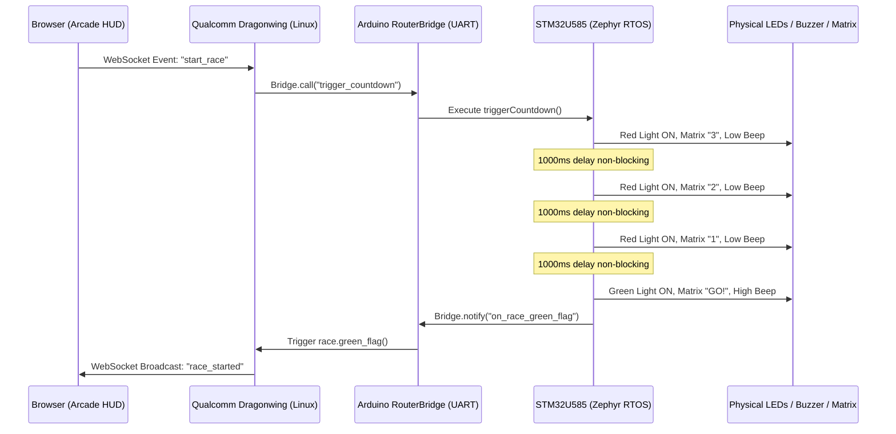

# GhostLine: Circuit Schematics & Hardware Wiring Guide

> **Contest Criteria**: Draw circuit diagrams using software or detailed diagrams/photographs (15 Points).

---

## 1. Electrical Overview & Pin Safety

> [!IMPORTANT]
> **Voltage Warning**: The Arduino UNO Q I/O headers operate at **3.3V logic**. 
> - Never apply 5V signals directly to the STM32 GPIO pins.
> - Maximum current per pin is **20 mA** (total MCU current limit is 200 mA).
> - All LEDs must use current-limiting series resistors (220Ω to 330Ω) to keep current draw safely around 5mA–8mA.

---

## 2. Pinout Connection Table

| Peripheral | Arduino UNO Q Pin | Component Pin / Terminal | Series Resistor | Function |
| :--- | :---: | :--- | :---: | :--- |
| **Race Start Red LED** | **D2** | Anode (+) | 220Ω | Lights during 3-2-1 countdown sequence |
| Red LED Return | **GND** | Cathode (-) | — | Ground path |
| **Sector Hazard Yellow LED** | **D3** | Anode (+) | 220Ω | Flashes during yellow flag / hazard state |
| Yellow LED Return | **GND** | Cathode (-) | — | Ground path |
| **Race Green LED** | **D4** | Anode (+) | 220Ω | Lights when race is active (Green Flag) |
| Green LED Return | **GND** | Cathode (-) | — | Ground path |
| **Race Buzzer** | **D5** | Positive (+) Pin | Direct (or 100Ω) | Emits countdown tones, lap chime, victory tune |
| Buzzer Ground | **GND** | Negative (-) Pin | — | Ground path |
| **8x13 LED Matrix** | Internal Bus | Onboard Display | Built-in | Displays countdown numbers, lap times, checkered flag |
| **USB Top-Down Camera** | USB-C Hub | USB-A / USB-C Port | — | Feeds video stream to Qualcomm MPU |
| **Power Supply (5V 3A)** | USB-C Hub PD | USB-C Power Input | — | Powers UNO Q and connected accessories |

---

## 3. Circuit Schematic Diagram

```
                       ARDUINO UNO Q (3.3V Logic)
                    +-----------------------------+
                    |                             |
                    |                         GND |---+
                    |                             |   |
                    |                 PIN D2 (Red)|---|-[ 220R ]--->| (Red LED) ----+
                    |                             |                             |
                    |              PIN D3 (Yellow)|---|-[ 220R ]--->| (Yellow LED) -+
                    |                             |                             |
                    |               PIN D4 (Green)|---|-[ 220R ]--->| (Green LED) --+
                    |                             |                             |
                    |              PIN D5 (Buzzer)|---+----------[+] (Piezo)      |
                    |                             |              [-] (Buzzer) --+
                    |                             |                             |
                    |  [ 8x13 Matrix ] (Internal) |                             |
                    |                             |                             |
                    |            [ USB-C Port ]   |                             |
                    +-----------------------------+                             |
                                   |                                            |
                                   | (High-Speed USB Data + Power)              |
                                   v                                            |
                    +-----------------------------+                             |
                    |    POWERED USB-C HUB        |                             |
                    |                             |                             |
                    |  [PD Power In] <== 5V 3A DC |                             |
                    |  [USB-A Port 1] <== Camera  |                             |
                    +-----------------------------+                             |
                                                                                |
  SYSTEM GROUND RAIL (Common GND) <---------------------------------------------+
```

---

## 4. Breadboard Wiring Walkthrough

Follow these simple steps to build the race signal gantry:

1. **Place the Components on the Breadboard**:
   - Insert the **Red LED** across rows 5 and 6 (Long leg = Anode in row 5; Short leg = Cathode in row 6).
   - Insert the **Yellow LED** across rows 10 and 11 (Long leg in row 10; Short leg in row 11).
   - Insert the **Green LED** across rows 15 and 16 (Long leg in row 15; Short leg in row 16).
   - Insert the **Piezo Buzzer** across rows 20 and 22 (`+` pin in row 20; `-` pin in row 22).

2. **Add Current Limiting Resistors**:
   - Connect a **220Ω resistor** between row 5 and row 1 (Red LED control rail).
   - Connect a **220Ω resistor** between row 10 and row 2 (Yellow LED control rail).
   - Connect a **220Ω resistor** between row 15 and row 3 (Green LED control rail).

3. **Wire Jumper Cables to Arduino UNO Q**:
   - Connect a jumper from row 1 to **Pin D2** on the Arduino.
   - Connect a jumper from row 2 to **Pin D3** on the Arduino.
   - Connect a jumper from row 3 to **Pin D4** on the Arduino.
   - Connect a jumper from row 20 (`+` buzzer) to **Pin D5** on the Arduino.

4. **Connect the Ground Rail**:
   - Connect a black jumper wire from one of the **GND** pins on the UNO Q header to the blue **(-) ground bus** on the breadboard.
   - Connect jumpers from rows 6, 11, 16, and 22 to the blue ground bus.

---

## 5. Dual-Processor Signal Flow Diagram


