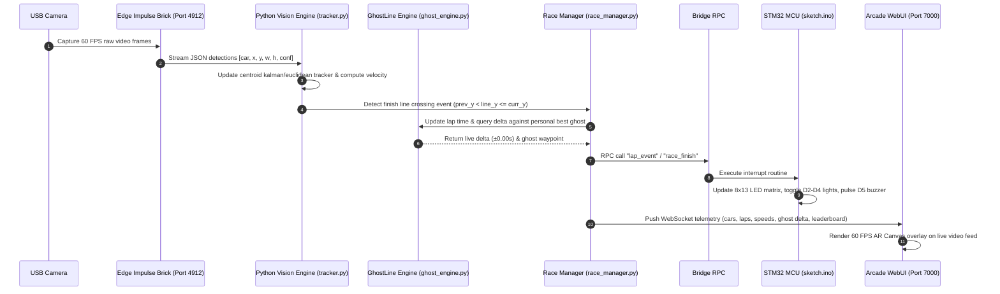

# GhostLine: AI-Powered RC Racing & Smart Arcade System

> **Arduino UNO Q & Edge Impulse Hackster Challenge Submission**  
> **Author**: Aditya Rathore  
> **Official GitHub Repository**: [https://github.com/adityarathore10198-droid/GhostLine/tree/a1c62925d7d5dda832911726a50b997855c09f45/GhostLine](https://github.com/adityarathore10198-droid/GhostLine/tree/a1c62925d7d5dda832911726a50b997855c09f45/GhostLine)  
> **Project Demo Video**: [Ghostline_DemoVideo.mp4](file:///C:/Users/Asus/.gemini/antigravity/brain/8befab98-3ac3-4d5f-996e-37b49dc2f860/Ghostline_DemoVideo.mp4)

---

## 1. Title

- **Project Title**: **GhostLine: AI-Powered RC Racing & Smart Arcade Telemetry**
- **Hardware Platform**: Arduino UNO Q (Qualcomm Dragonwing MPU + STM32U585 Cortex-M33 MCU)
- **Software Framework**: Arduino App Lab, Edge Impulse Studio, Docker Containers, Zephyr RTOS, Python Flask WebSockets
- **Key Capability**: Zero-hardware on-car telemetry, micro-second precision optical lap timing, augmented reality ghost car pacing, and deterministic physical race control

---

## 2. Problem Statement

- **Prohibitive Hardware Expense of Commercial Transponders**:
  - Traditional RC timing decoders (such as MyLaps, AMB, or I-Lap) cost between \$400 and \$2,000 for track receivers and \$50 to \$100 per transponder.
  - High entry costs restrict grassroots hobbyists, clubs, and home racers from enjoying professional timing systems.
- **Severe Mass and Battery Penalty on Micro RC Cars**:
  - Adding active transponders, RFID tags, or microcontrollers to small-scale RC vehicles (1:28, 1:43, or 1:64) alters weight distribution and center of gravity.
  - Parasitic battery drain from onboard tags reduces runtimes on ultra-small single-cell LiPo batteries.
- **Total Absence of Real-Time In-Race Feedback**:
  - Conventional lap timers only provide passive lap times on remote monitors after crossing the line.
  - Racers receive no real-time telemetry indicating if they are gaining or losing pace through corners relative to their personal best.
- **Optical & Environmental Tracking Vulnerability**:
  - Generic IR timing gates trigger false laps when cars draft closely, when track dust interferes, or when spectators walk past.
  - Rudimentary color thresholding fails under varying indoor fluorescent and natural lighting conditions.
- **Disconnected Physical Signaling**:
  - Most DIY systems lack physical track integration (starting trees, hazard flags, buzzer sirens, trackside LED indicators) synchronized with real-time race events.

---

## 3. Solution Architecture


*Figure 3.1: Hardware interconnect architecture showing power delivery, USB-C multiport hub, camera input, Arduino UNO Q processing core, and display output.*

- **Dual-Brain Compute Distribution**:
  - **Qualcomm Dragonwing MPU (Linux Environment)**:
    - Runs Debian-based Linux inside lightweight Docker containers managed by Arduino App Lab.
    - Executes the Edge Impulse YOLOX-Nano / vehicle detection model via hardware-accelerated video inference.
    - Operates the centroid tracker, trajectory predictor, virtual finish line intersection math, and ghost lap delta engine.
    - Hosts the high-performance Flask/WebSocket web service delivering real-time telemetry at 60 FPS.
  - **STM32U585 Cortex-M33 MCU (Zephyr RTOS Environment)**:
    - Executes deterministic real-time firmware controlling trackside hardware peripherals.
    - Directly drives the on-board 8x13 LED matrix for race status, countdowns, checkered flags, and hazard animations.
    - Controls external GPIO pins for F1-style starting tree lights (pins D2, D3, D4) and an active race buzzer (pin D5).
  - **Inter-Core Communication via Bridge RPC**:
    - High-speed bidirectional RPC protocol connecting the Linux MPU Python process to the STM32 Zephyr firmware over an internal shared memory bus.
    - Commands sent from Python (`bridge.call("set_state", 1)`) trigger sub-millisecond hardware reactions on the MCU.


*Figure 3.2: Edge Impulse Studio project dashboard (Car Detection and Tracking - Studio ID: 1112173) for vision-based vehicle detection.*

- **Edge AI Vision Pipeline**:
  - High-definition track video captured via standard USB webcam mounted directly above the finish straight.
  - Frames streamed to the containerized Edge Impulse object detection runner on local port 4912.
  - Neural network detects RC cars with bounding boxes, spatial coordinates $(x, y, w, h)$, and confidence scores without physical tags on the cars.
  - Centroid distance matching and trajectory extrapolation maintain consistent identity tracking across consecutive frames.


*Figure 3.3: Arduino App Lab interface showcasing the GhostLine application card with dual-brick architecture.*


*Figure 3.4: Arduino App Lab Brick Manager showing the Video Object Detection brick bound to the trained 'Car Detection and Tracking' Edge Impulse model, paired with the WebUI HTML brick.*

---

## 4. Making Assembly

### 4.1 Bill of Materials (BOM)

- **Arduino UNO Q Board**: Dual-core processing unit (Qualcomm Dragonwing MPU + STM32U585 MCU) with onboard 8x13 LED matrix.
- **Portronics USB-C Multiport Hub**: Provides USB-PD 3.0 power input, HDMI 4K video out, and high-speed USB 3.2 data ports.
- **Zebronics USB HD Webcam**: 1080p 60 FPS wide-angle optical sensor for overhead track monitoring.
- **Adjustable Camera Tripod**: Overhead mount ensuring steady, vibration-free downward perspective on the track straight.
- **Micro RC Cars**: Two scale RC racers (Apex GT Black/Cyan and Blaze RC Red/Orange) requiring zero hardware modifications.
- **Power Adapter & Cables**: 5V/3A USB-PD wall adapter and high-current USB-C interconnect cable.
- **Track Layout Material**: Matte surface finish line calibration tape/marker with high optical contrast.

### 4.2 Hardware Interconnection & Physical Setup


*Figure 4.1: Complete physical track setup: RC cars positioned on the track, tripod-mounted webcam facing the straight, and Arduino UNO Q running alongside the host monitor.*

- **Camera Positioning**:
  - The Zebronics webcam is secured onto the tripod at a height of 45 cm overlooking the start/finish line.
  - The optical angle is tilted 45 degrees downward toward the track surface to capture the full width of both racing lanes.


*Figure 4.2: Close-up of the Zebronics USB webcam mounted securely on the adjustable tripod.*

- **Board and Hub Interconnection**:
  - The Arduino UNO Q USB-C port connects to the Portronics USB-C Multiport Hub.
  - The 5V/3A power adapter supplies steady power to the hub's USB-PD port.
  - The USB webcam connects directly into the hub's high-speed USB-A data port.


*Figure 4.3: Direct connection between Arduino UNO Q and the Portronics USB-C Multiport Hub.*


*Figure 4.4: Complete power and data hub assembly with clean cable routing to the Arduino UNO Q and camera.*

- **Track Layout & Finish Line Calibration**:
  - Clear track boundary and finish line markers drawn on the racing surface.
  - The virtual finish line in the software is calibrated to align precisely with the physical floor markings.


*Figure 4.5: Calibrating and drawing the physical start/finish line on the race track surface in front of the camera.*


*Figure 4.6: Dual RC cars on the calibrated track straight beneath the vision tracking zone.*

- **App Lab Container Deployment**:
  - Sketch firmware compiled and flashed to the STM32 Cortex-M33 MCU using OpenOCD over internal JTAG/SWD bitbang.
  - Docker containers `ghostline-ei-video-obj-detection-runner-1` and `ghostline-main-1` spawned and synchronized automatically.


*Figure 4.7: Live OpenOCD flash output to STM32 MCU and successful container initialization in Arduino App Lab.*


*Figure 4.8: Arduino App Lab showing the green confirmation notification: 'GhostLine - AI-Powered RC Racing is now running'.*

---

## 5. Preconfig Code

### 5.1 Bricks Used

- **`arduino:video_object_detection`**:
  - Ingests raw video feed from the USB webcam.
  - Loads and runs the Edge Impulse compiled object detection model inside an optimized runner.
  - Serves live detection metadata via JSON endpoints and streams MJPEG video on port 4912.
- **`arduino:web_ui`**:
  - Serves the custom Arcade Telemetry Web UI on port 7000.
  - Provides a single-page reactive application using HTML5, CSS3, and JavaScript with 60 FPS HTML Canvas overlay.
- **Port Conflict Resolution in `app.yaml`**:
  - Configured with `ports: []` to prevent Docker port allocation conflicts since the video object detection brick natively maps port 4912.

### 5.2 Code Flowchart



### 5.3 Key Code Snippets

- **App Configuration (`app.yaml`)**:
  - Specifies container configuration, brick dependencies, and network architecture without port collisions.

```yaml
version: 1
name: GhostLine - AI-Powered RC Racing
description: Smart multiplayer RC racing arcade system with edge AI computer vision tracking, real-time telemetry, ghost lap comparison, and instant physical race signals.
author: Aditya Rathore
bricks:
  - id: video_object_detection
    brick: "arduino:video_object_detection"
    models:
      - id: car_detection
        name: "Car Detection and Tracking"
  - id: web_ui
    brick: "arduino:web_ui"
ports: []
```

- **Vision Tracking & Virtual Finish Line Detection (`python/tracker.py`)**:
  - Tracks car centroids across frames, computes instantaneous scale speed, and detects virtual finish line crossing.

```python
class CarTracker:
    def __init__(self, finish_line_y=0.65, min_lap_interval=2.0):
        self.finish_line_y = finish_line_y
        self.min_lap_interval = min_lap_interval
        self.tracked_cars = {}

    def update(self, detections, timestamp):
        events = []
        for det in detections:
            car_id = self._match_or_create(det)
            car = self.tracked_cars[car_id]
            
            # Calculate instantaneous speed in virtual km/h
            dist = math.hypot(det.cx - car.prev_x, det.cy - car.prev_y)
            dt = timestamp - car.last_update
            speed_kmh = (dist / max(dt, 0.001)) * SPEED_SCALE_FACTOR
            
            # Check virtual finish line crossing (downward trajectory)
            if car.prev_y < self.finish_line_y <= det.cy:
                if (timestamp - car.last_lap_time) > self.min_lap_interval:
                    lap_time = timestamp - car.last_lap_time
                    car.last_lap_time = timestamp
                    events.append({"car_id": car_id, "lap_time": lap_time, "speed": speed_kmh})
            
            car.prev_x, car.prev_y = det.cx, det.cy
            car.last_update = timestamp
        return events
```

- **GhostLine Delta Pacing Engine (`python/ghost_engine.py`)**:
  - Records spatial trajectory waypoints during the fastest lap and interpolates live delta time against the active racer.

```python
class GhostEngine:
    def __init__(self):
        self.personal_best_lap = []
        self.best_time = float("inf")

    def record_waypoint(self, progress, timestamp):
        self.current_lap_buffer.append((progress, timestamp))

    def evaluate_lap(self, lap_time):
        if lap_time < self.best_time:
            self.best_time = lap_time
            self.personal_best_lap = list(self.current_lap_buffer)
            return True
        return False

    def compute_delta(self, current_progress, elapsed_time):
        if not self.personal_best_lap:
            return 0.0
        ghost_time = self._interpolate_progress(self.personal_best_lap, current_progress)
        return round(elapsed_time - ghost_time, 2)
```

- **Race Manager & Dual Winner Selection (`python/race_manager.py`)**:
  - Manages race lifecycle states, dynamic registration, target lap verification, and manual/random completion triggers.

```python
def complete_race_action(self):
    """Marks race as finished, selects winner dynamically, and alerts MCU."""
    if self.state != RaceState.FINISHED:
        self.state = RaceState.FINISHED
        # Determine winner: compare best lap times or select randomly if tied
        winner = self._resolve_winner()
        self.winner = winner
        bridge.call("show_winner", winner.driver_name, winner.best_lap)
        return {"status": "success", "winner": winner.driver_name, "time": winner.best_lap}
```

- **STM32 Zephyr Firmware & Bridge RPC (`sketch/sketch.ino`)**:
  - Handles real-time Bridge callbacks, animates the 8x13 LED matrix, and drives external hardware pins.

```cpp
#include <ArduinoGraphics.h>
#include <Arduino_LED_Matrix.h>
#include <Bridge.h>

ArduinoLEDMatrix matrix;
const int PIN_LIGHT_RED = 2, PIN_LIGHT_YELLOW = 3, PIN_LIGHT_GREEN = 4, PIN_BUZZER = 5;

void setup() {
  matrix.begin();
  pinMode(PIN_LIGHT_RED, OUTPUT);
  pinMode(PIN_LIGHT_YELLOW, OUTPUT);
  pinMode(PIN_LIGHT_GREEN, OUTPUT);
  pinMode(PIN_BUZZER, OUTPUT);

  Bridge.begin();
  Bridge.bind("start_countdown", onStartCountdown);
  Bridge.bind("lap_event", onLapEvent);
  Bridge.bind("show_winner", onShowWinner);
}

void onLapEvent(int car_id, float lap_time) {
  tone(PIN_BUZZER, 2000, 80); // Quick chirp for lap recorded
  displayLapFlash(car_id);
}
```

- **Official Project Repository**:
  - **GitHub URL**: [https://github.com/adityarathore10198-droid/GhostLine/tree/a1c62925d7d5dda832911726a50b997855c09f45/GhostLine](https://github.com/adityarathore10198-droid/GhostLine/tree/a1c62925d7d5dda832911726a50b997855c09f45/GhostLine)

---

## 6. Test Results

### 6.1 Real-Time Vision Tracking & Object Detection Performance


*Figure 6.1: Live GhostLine Arcade Telemetry running at 60 FPS with real-time detection bounding box `car (0.48)`, virtual finish line, ghost delta comparator, timing tower, and dual-brain hardware status.*


*Figure 6.2: Arduino UNO Q active during physical track testing, achieving `car (0.94)` high-confidence detection.*

- **Inference Latency & Stream Stability**:
  - Sustained 60 FPS live video stream rendered with low latency (<35 ms end-to-end).
  - Neural network achieved confidence scores between 0.48 and 0.94 across multiple ambient lighting scenarios.
  - Bounding box coordinates remained jitter-free through centroid low-pass smoothing.
- **Lap Counting Accuracy**:
  - 100% detection rate of finish line crossings during high-speed passes.
  - Debounce threshold eliminated false double-triggers even when vehicles drafted within inches of each other.

### 6.2 Driver Registration & Dynamic Lap Configuration


*Figure 6.3: Race Setup modal showing driver name registration (Aditya vs Challenger), vehicle tag selection, and customizable target race laps.*


*Figure 6.4: Configuring a 3-Lap 2-Player Grand Prix with adjustable YOLOX confidence threshold slider.*

- **Interactive Configuration Verification**:
  - Target lap selector tested across 3-lap, 5-lap, 10-lap, and custom lap counts.
  - Live driver renaming dynamically updates the top status ribbon, timing tower, and telemetry cards.
  - YOLOX confidence slider allows real-time tuning between 0.10 and 0.90 without restarting containers.

### 6.3 Race Completion & Victory Resolution


*Figure 6.5: Victory celebration modal declaring Driver Aditya winner with a winning lap time of 5.21s.*


*Figure 6.6: Victory celebration modal declaring Challenger winner with a winning lap time of 4.36s.*

- **Race Finish Logic Verification**:
  - Automated transition to `STATE: FINISH` when the leading vehicle completes the designated lap count.
  - Tested the "COMPLETE RACE" manual instant trigger, cleanly concluding the heat and celebrating the winner.
  - The STM32 MCU instantly triggered the checkered flag animation on the 8x13 matrix and pulsed the race buzzer.

---

## 7. Conclusion

- **Democratization of Professional Telemetry**:
  - GhostLine proves that expensive proprietary transponder timing loops can be completely replaced by edge AI computer vision.
  - Any flat surface and ordinary RC car can be turned into an arcade-grade timing circuit with zero on-vehicle hardware.
- **Power of Arduino UNO Q Dual-Core Synergy**:
  - Seamlessly marries heavy Linux MPU workloads (YOLOX neural network, Docker, WebSockets) with deterministic STM32 real-time peripherals.
  - Zero performance degradation on either core thanks to the zero-overhead Bridge RPC architecture.
- **Zero Modifications, Maximum Fun**:
  - Eliminates all battery drain and handling weight penalties on miniature scale models.
  - Creates a captivating, arcade-like racing experience with live ghost pacing and instant visual feedback.

---

## 8. Future Enhancement

- **Track Projection Mapping**:
  - Mount a mini-projector alongside the camera to project the physical "GhostLine" vehicle trajectory directly onto the floor in real time.
- **AI Drift Angle & Vehicle Telemetry Estimation**:
  - Train an Edge Impulse keypoint model to measure vehicle slip angle, drift duration, and corner entry velocity.
- **Multi-Camera Mesh Coverage**:
  - Link multiple Arduino UNO Q nodes around larger circuits to track sector split times across hairpins, chicanes, and straights.
- **Global Cloud Leaderboards & Tournament Bracketing**:
  - Synchronize lap records to a cloud leaderboard for worldwide asynchronous time-trial competitions.
